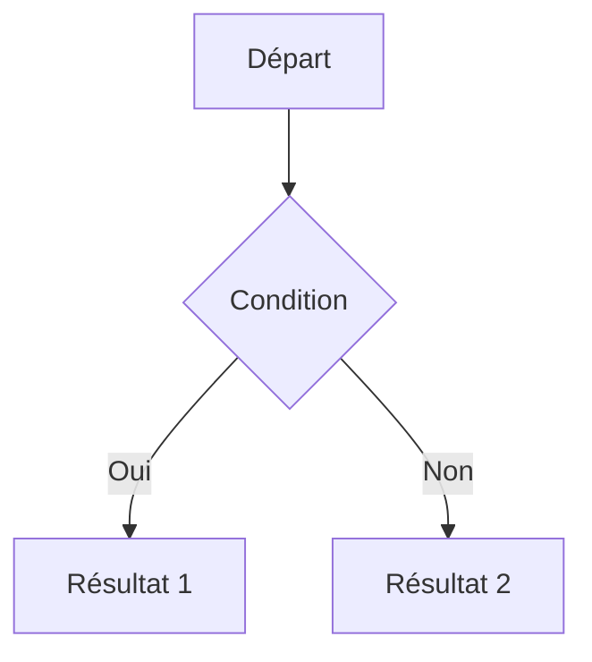

# Markdown Cheatsheet

Un guide de référence complet pour la syntaxe Markdown (GFM — GitHub Flavored Markdown).

---

## Titres

```markdown
# H1 — Titre principal
## H2 — Section
### H3 — Sous-section
#### H4
##### H5
###### H6
```

---

## Mise en forme du texte

| Rendu | Syntaxe |
|---|---|
| **Gras** | `**texte**` ou `__texte__` |
| *Italique* | `*texte*` ou `_texte_` |
| ***Gras + Italique*** | `***texte***` |
| ~~Barré~~ | `~~texte~~` |
| `Code inline` | `` `code` `` |
| <u>Souligné</u> (HTML) | `<u>texte</u>` |

---

## Listes

### Liste non ordonnée

```markdown
- Item 1
- Item 2
  - Sous-item (2 espaces d'indentation)
- Item 3
```

### Liste ordonnée

```markdown
1. Premier
2. Deuxième
3. Troisième
```

### Liste de tâches (GFM)

```markdown
- [x] Tâche terminée
- [ ] Tâche en cours
- [ ] Tâche à faire
```

---

## Liens et images

```markdown
[Texte du lien](https://example.com)
[Lien avec titre](https://example.com "Titre au survol")


<!-- Référence -->
[lien][ref]
[ref]: https://example.com
```

---

## Blocs de code

### Inline

```markdown
Utilisez la commande `kubectl get pods` pour lister les pods.
```

### Bloc avec coloration syntaxique

````markdown
```bash
kubectl get pods -n monitoring
```

```python
def hello():
    print("Hello, world!")
```

```yaml
apiVersion: v1
kind: Pod
metadata:
  name: my-pod
```
````

---

## Tableaux

```markdown
| Colonne 1 | Colonne 2 | Colonne 3 |
|-----------|:---------:|----------:|
| Gauche    | Centré    | Droite    |
| Valeur A  | Valeur B  | Valeur C  |
```

> `:---` = aligné à gauche, `:---:` = centré, `---:` = aligné à droite

---

## Citations (Blockquotes)

```markdown
> Citation simple

> Citation sur
> plusieurs lignes

> Citation imbriquée
>> Niveau 2
>>> Niveau 3
```

---

## Séparateurs

```markdown
---
***
___
```

---

## Échappement

Préfixez avec `\` pour échapper les caractères spéciaux :

```markdown
\* \_ \` \# \[ \] \( \) \! \\ \{ \} \| \~
```

---

## HTML inline

Markdown supporte l'HTML inline :

```markdown
<br> — saut de ligne
<details>
  <summary>Titre cliquable</summary>
  Contenu masqué par défaut.
</details>

<kbd>Ctrl</kbd> + <kbd>C</kbd>
```

---

## Footnotes (GFM étendu)

```markdown
Texte avec note de bas de page.[^1]

[^1]: Contenu de la note de bas de page.
```

---

## Alertes GitHub (GFM)

```markdown
> [!NOTE]
> Information utile.

> [!TIP]
> Conseil pratique.

> [!WARNING]
> Avertissement important.

> [!CAUTION]
> Action à risque.

> [!IMPORTANT]
> Information critique.
```

---

## Liens automatiques

```markdown
<https://example.com>
<email@example.com>
```

---

## Ancres et navigation interne

```markdown
[Aller aux tableaux](#tableaux)
```

> Les ancres sont générées automatiquement depuis les titres (minuscules, espaces → `-`).

---

## Emojis (GFM GitHub)

```markdown
:rocket: :white_check_mark: :warning: :bulb: :fire:
```

---

## Mermaid (diagrammes, GFM GitHub)

````markdown

````

---

## Résumé des symboles clés

| Élément | Symbole |
|---|---|
| Titres | `#` à `######` |
| Gras | `**` ou `__` |
| Italique | `*` ou `_` |
| Code | `` ` `` ou ```` ``` ```` |
| Lien | `[texte](url)` |
| Image | `` |
| Citation | `>` |
| Séparateur | `---` |
| Liste | `-` / `1.` |
| Tâche | `- [x]` |
| Tableau | `\|` et `-` |
| Barré | `~~` |
